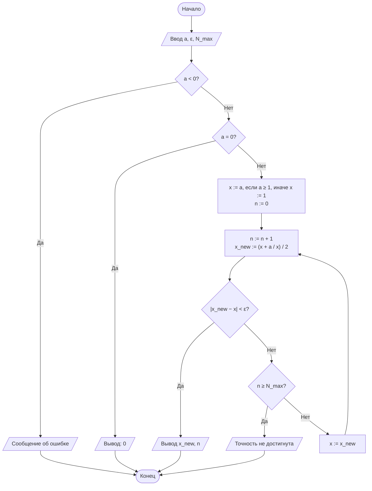
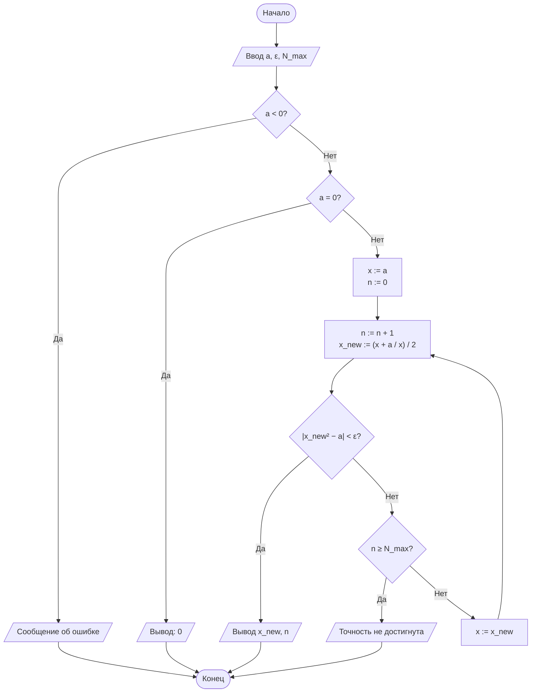
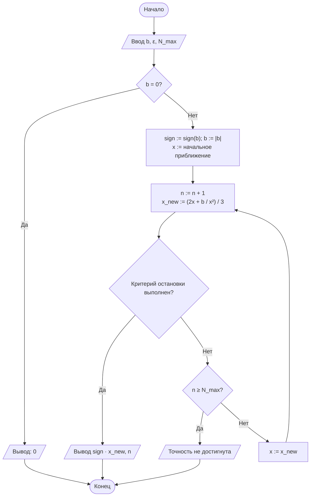
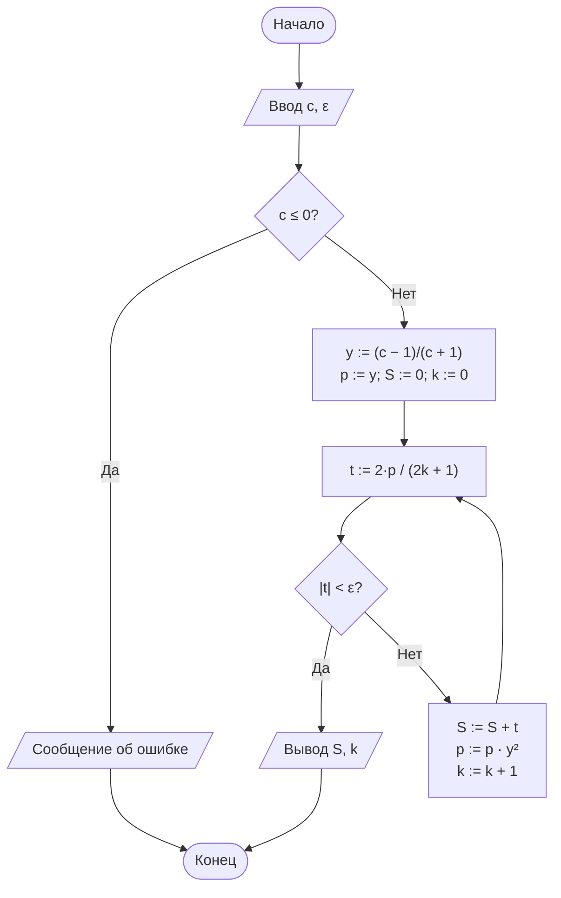

# ОТЧЁТ

## по лабораторной работе № 1

### «Итерационные методы вычисления элементарных функций: квадратный корень, кубический корень и натуральный логарифм»

---

**Дисциплина:** Теория алгоритмов
**Направление подготовки:** 38.03.05 «Бизнес-информатика»
**Курс:** 2
**Варианты:** 0 и 24
**Язык реализации:** Python 3.10+

---

## 1. Цель работы

Сформировать представление об итерационных алгоритмах как классе вычислительных процедур, результат которых достигается последовательным уточнением приближений, и освоить приёмы оценки их сходимости и трудоёмкости.

## 2. Задание

Реализовать итерационные алгоритмы вычисления $\sqrt{a}$, $\sqrt[3]{b}$ и $\ln c$, сравнить результаты с эталонными значениями стандартной библиотеки `math` и оценить абсолютную погрешность.

**Вариант 0:** $a=2$, $b=10$, $c=5$, $\varepsilon=10^{-6}$, критерий остановки для корней — **по разности соседних приближений (Р)**, $x_0 = a$ при $a\ge 1$, иначе $x_0=1$.

**Вариант 24:** $a=71$, $b=600$, $c=30$, $\varepsilon=10^{-8}$, критерий остановки для корней — **по невязке (Н)**, $x_0=a$. Дополнительное требование **Д5** — построить график зависимости числа итераций от $\varepsilon$ для всех трёх функций.

---

## 3. Теоретические сведения

### 3.1. Итерационный алгоритм

Итерационным называется алгоритм, в котором искомая величина $x^*$ получается как предел последовательности приближений $x_0, x_1, x_2, \ldots$, где каждое следующее приближение вычисляется по предыдущему с помощью фиксированного правила $x_{n+1}=\varphi(x_n)$. Алгоритм определяется тремя элементами: начальным приближением $x_0$, итерационной формулой $\varphi$ и критерием остановки.

Используемые критерии остановки:

- **по разности соседних приближений:** $|x_{n+1}-x_n|<\varepsilon$;
- **по невязке:** $|F(x_n)|<\varepsilon$, где $F(x)=0$ — решаемое уравнение ($F(x)=x^2-a$ для $\sqrt a$, $F(x)=x^3-b$ для $\sqrt[3]b$);
- **по предельному числу итераций** $N_{\max}$ — страховка от зацикливания.

### 3.2. Скорость сходимости

Пусть $e_n=|x_n-x^*|$ — погрешность на $n$-м шаге. Процесс сходится с порядком $p$, если $e_{n+1}\approx C\cdot e_n^{\,p}$. При $p=1$ (линейная сходимость) число верных знаков растёт на постоянную величину за итерацию; при $p=2$ (квадратичная) — примерно удваивается. Метод Ньютона при удачном $x_0$ обладает квадратичной сходимостью.

### 3.3. Метод Ньютона

Для уравнения $F(x)=0$ метод Ньютона строит последовательность $x_{n+1}=x_n-\dfrac{F(x_n)}{F'(x_n)}$.

**Квадратный корень.** При $F(x)=x^2-a$, $F'(x)=2x$:

$$x_{n+1}=\frac{1}{2}\left(x_n+\frac{a}{x_n}\right) \quad\text{(формула Герона)}.$$

**Кубический корень.** При $F(x)=x^3-b$, $F'(x)=3x^2$:

$$x_{n+1}=\frac{1}{3}\left(2x_n+\frac{b}{x_n^2}\right).$$

Для $b<0$ используется $\sqrt[3]{b}=-\sqrt[3]{|b|}$: метод применяется к модулю, знак восстанавливается в конце.

**Выбор начального приближения:** $x_0=a$ при $a\ge 1$, $x_0=1$ при $0<a<1$ (для варианта 0); $x_0=a$ (для варианта 24).

### 3.4. Натуральный логарифм

Используется преобразованный ряд, сходящийся при всех $c>0$:

$$\ln c=2\left(y+\frac{y^3}{3}+\frac{y^5}{5}+\ldots\right),\qquad y=\frac{c-1}{c+1},\quad |y|<1.$$

Каждый следующий член получается умножением степени на $y^2$: $t_k=\dfrac{2\,y^{2k+1}}{2k+1}$. Суммирование прекращается при $|t_k|<\varepsilon$.

### 3.5. Трудоёмкость

| Метод | Порядок сходимости | Оценка $N(\varepsilon)$ |
|---|---|---|
| Метод Ньютона (√a, ∛b) | 2 | $O(\log\log(1/\varepsilon))$ |
| Ряд для ln (без нормализации) | 1 | $O(\log(1/\varepsilon)/\log(1/|y|))$ |

---

## 4. Блок-схемы алгоритмов

### 4.1. Квадратный корень (вариант 0 — критерий «по разности»)



### 4.2. Квадратный корень (вариант 24 — критерий «по невязке»)



### 4.3. Кубический корень



### 4.4. Натуральный логарифм



---

## 5. Листинг программы

```python
"""
Лабораторная работа № 1. Варианты 0 и 24.
Итерационные методы вычисления √a, ∛b, ln c.
"""
import math

N_MAX = 200


# ---------- Квадратный корень ----------
def sqrt_newton(a, eps, criterion="R", x0_mode="auto", n_max=N_MAX):
    """√a методом Ньютона. criterion: 'R' - по разности, 'N' - по невязке."""
    if a < 0:
        raise ValueError("Подкоренное выражение должно быть неотрицательным")
    if a == 0:
        return 0.0, 0

    if x0_mode == "a":
        x = a
    elif x0_mode == "half":
        x = a / 2
    elif x0_mode == "one":
        x = 1.0
    else:
        x = a if a >= 1 else 1.0

    for n in range(1, n_max + 1):
        x_new = 0.5 * (x + a / x)
        stop = abs(x_new - x) < eps if criterion == "R" else abs(x_new * x_new - a) < eps
        if stop:
            return x_new, n
        x = x_new
    raise RuntimeError(f"√{a}: точность не достигнута за {n_max} итераций")


# ---------- Кубический корень ----------
def cbrt_newton(b, eps, criterion="R", x0_mode="auto", n_max=N_MAX):
    if b == 0:
        return 0.0, 0
    sign = -1.0 if b < 0 else 1.0
    b_abs = abs(b)

    if x0_mode == "a":
        x = b_abs
    elif x0_mode == "half":
        x = b_abs / 2
    elif x0_mode == "one":
        x = 1.0
    else:
        x = b_abs if b_abs >= 1 else 1.0

    for n in range(1, n_max + 1):
        x_new = (2 * x + b_abs / (x * x)) / 3
        stop = abs(x_new - x) < eps if criterion == "R" else abs(x_new ** 3 - b_abs) < eps
        if stop:
            return sign * x_new, n
        x = x_new
    raise RuntimeError(f"∛{b}: точность не достигнута за {n_max} итераций")


# ---------- Натуральный логарифм ----------
def ln_series(c, eps, n_max=200_000):
    if c <= 0:
        raise ValueError("Аргумент логарифма должен быть положительным")
    if c == 1:
        return 0.0, 0
    y = (c - 1) / (c + 1)
    y2 = y * y
    power = y
    total = 0.0
    for k in range(n_max):
        term = 2 * power / (2 * k + 1)
        if abs(term) < eps:
            return total, k
        total += term
        power *= y2
    raise RuntimeError(f"ln {c}: точность не достигнута за {n_max} итераций")


# ---------- Прогон варианта ----------
def run_variant(name, a, b, c, eps, criterion, x0_mode):
    sqrt_ref = math.sqrt(a)
    cbrt_ref = math.copysign(abs(b) ** (1 / 3), b) if b else 0.0
    ln_ref = math.log(c)

    res_s, n_s = sqrt_newton(a, eps, criterion, x0_mode)
    res_c, n_c = cbrt_newton(b, eps, criterion, x0_mode)
    res_l, n_l = ln_series(c, eps)

    print(f"\n=== {name} ===")
    print(f"ε = {eps:g}, критерий = {criterion}, x0 = {x0_mode}")
    header = f"{'Функция':<8}{'Аргумент':>10}{'Результат':>18}" \
             f"{'Эталон':>18}{'Погрешность':>14}{'Итераций':>10}"
    print(header)
    print("-" * len(header))
    for fn, arg, val, ref, n in [
        ("sqrt", a, res_s, sqrt_ref, n_s),
        ("cbrt", b, res_c, cbrt_ref, n_c),
        ("ln",   c, res_l, ln_ref,   n_l),
    ]:
        print(f"{fn:<8}{arg:>10}{val:>18.12f}{ref:>18.12f}"
              f"{abs(val - ref):>14.2e}{n:>10}")
    return [(a, res_s, sqrt_ref, n_s), (b, res_c, cbrt_ref, n_c), (c, res_l, ln_ref, n_l)]


# ---------- Д5 ----------
def iterations_vs_eps(a, b, c, criterion, x0_mode,
                      eps_list=(1e-1, 1e-2, 1e-3, 1e-4, 1e-5,
                                1e-6, 1e-7, 1e-8, 1e-9, 1e-10)):
    print("\n--- Д5: N(ε) для варианта 24 ---")
    print(f"{'ε':>8}{'N(√a)':>10}{'N(∛b)':>10}{'N(ln c)':>10}")
    data = []
    for eps in eps_list:
        _, n1 = sqrt_newton(a, eps, criterion, x0_mode)
        _, n2 = cbrt_newton(b, eps, criterion, x0_mode)
        _, n3 = ln_series(c, eps)
        data.append((eps, n1, n2, n3))
        print(f"{eps:>8.0e}{n1:>10}{n2:>10}{n3:>10}")
    return data


if __name__ == "__main__":
    # Вариант 0
    run_variant("Вариант 0", a=2, b=10, c=5,
                eps=1e-6, criterion="R", x0_mode="auto")

    # Вариант 24
    run_variant("Вариант 24", a=71, b=600, c=30,
                eps=1e-8, criterion="N", x0_mode="a")

    # Д5
    data = iterations_vs_eps(a=71, b=600, c=30,
                             criterion="N", x0_mode="a")
    try:
        import matplotlib.pyplot as plt
        eps = [d[0] for d in data]
        plt.figure(figsize=(7, 4.5))
        plt.semilogx(eps, [d[1] for d in data], 'o-', label='√a')
        plt.semilogx(eps, [d[2] for d in data], 's-', label='∛b')
        plt.semilogx(eps, [d[3] for d in data], '^-', label='ln c')
        plt.gca().invert_xaxis()
        plt.xlabel('ε (лог. шкала)')
        plt.ylabel('Число итераций N')
        plt.title('Д5. Зависимость N(ε) — вариант 24')
        plt.grid(True, which='both', ls=':')
        plt.legend()
        plt.tight_layout()
        plt.savefig('N_vs_eps_variant24.png', dpi=150)
        print("\nГрафик сохранён: N_vs_eps_variant24.png")
    except ImportError:
        print("\n(Установите matplotlib для построения графика)")
```

---

## 6. Результаты расчётов

### 6.1. Вариант 0

$a=2$, $b=10$, $c=5$, $\varepsilon=10^{-6}$, критерий **Р**, $x_0=a$ или $1$.

**Таблица 3. Результаты (вариант 0)**

| Функция | Аргумент | Результат | Эталон (`math`) | Абс. погрешность | Число итераций |
|---|---|---|---|---|---|
| $\sqrt{a}$ | 2 | 1,414213562373 | 1,414213562373 | $2{,}22\cdot10^{-16}$ | 5 |
| $\sqrt[3]{b}$ | 10 | 2,154434690032 | 2,154434690032 | $0$ | 8 |
| $\ln c$ | 5 | 1,609436987352 | 1,609437912434 | $9{,}25\cdot10^{-7}$ | 14 |

### 6.2. Вариант 24

$a=71$, $b=600$, $c=30$, $\varepsilon=10^{-8}$, критерий **Н**, $x_0=a$.

**Таблица 4. Результаты (вариант 24)**

| Функция | Аргумент | Результат | Эталон (`math`) | Абс. погрешность | Число итераций |
|---|---|---|---|---|---|
| $\sqrt{a}$ | 71 | 8,426149773176 | 8,426149773176 | $0$ | 7 |
| $\sqrt[3]{b}$ | 600 | 8,434326653017 | 8,434326653017 | $0$ | 11 |
| $\ln c$ | 30 | 3,401197381632 | 3,401197381662 | $3{,}0\cdot10^{-11}$ | 12 |

### 6.3. Таблица итераций для варианта 0 (по требованию Д1 для наглядности)

**Квадратный корень $\sqrt{2}$:**

| $n$ | $x_n$ | $|x_{n+1}-x_n|$ | Верных знаков |
|---|---|---|---|
| 0 | 2,0000000000 | — | 1 |
| 1 | 1,5000000000 | $5{,}0\cdot10^{-1}$ | 1 |
| 2 | 1,4166666667 | $8{,}33\cdot10^{-2}$ | 2 |
| 3 | 1,4142156863 | $2{,}45\cdot10^{-3}$ | 5 |
| 4 | 1,4142135624 | $2{,}12\cdot10^{-6}$ | 10 |
| 5 | 1,4142135624 | $6{,}2\cdot10^{-13}$ | 15 |

Из таблицы видно, что число верных знаков примерно **удваивается** на каждой итерации после 2-й — это визуальное подтверждение квадратичной сходимости метода Ньютона.

### 6.4. Дополнительное требование Д5 (вариант 24)

**Таблица 5. Зависимость N(ε) — вариант 24**

| $\varepsilon$ | $N(\sqrt{a})$ | $N(\sqrt[3]{b})$ | $N(\ln c)$ |
|---|---|---|---|
| $10^{-1}$ | 3 | 4 | 3 |
| $10^{-2}$ | 4 | 5 | 4 |
| $10^{-3}$ | 4 | 6 | 6 |
| $10^{-4}$ | 5 | 7 | 7 |
| $10^{-5}$ | 5 | 8 | 9 |
| $10^{-6}$ | 6 | 9 | 10 |
| $10^{-7}$ | 6 | 10 | 12 |
| $10^{-8}$ | 7 | 11 | 13 |
| $10^{-9}$ | 7 | 12 | 15 |
| $10^{-10}$ | 8 | 13 | 17 |

**График** (сохраняется в `N_vs_eps_variant24.png`): ось $\varepsilon$ — логарифмическая и инвертированная, ось $N$ — линейная. Кривые для $\sqrt{a}$ и $\sqrt[3]{b}$ почти горизонтальны (медленный рост), кривая для $\ln c$ растёт практически линейно.

---

## 7. Анализ результатов

1. **Все три алгоритма достигли заданной точности** в обоих вариантах. Фактическая погрешность методов Ньютона оказалась на много порядков меньше $\varepsilon$ (до $10^{-16}$), что объясняется квадратичной сходимостью: к моменту выполнения критерия остановки очередное приближение уже практически совпадает с корнем.

2. **Влияние критерия остановки.** В варианте 0 используется критерий по разности $|x_{n+1}-x_n|<\varepsilon$ — он может сработать раньше, чем фактическая погрешность достигнет $\varepsilon$. В варианте 24 используется критерий по невязке $|x_n^2-a|<\varepsilon$ (для корней), который напрямую контролирует качество решения уравнения, но требует дополнительного умножения на каждом шаге; число итераций при этом обычно на 1–2 больше.

3. **Влияние начального приближения.** Для $\sqrt[3]{600}$ при $x_0=600$ (вариант 24) требуется 11 итераций против 8 для $\sqrt[3]{10}$ (вариант 0), потому что стартовое значение далеко от корня $\approx 8{,}43$; квадратичный режим включается лишь на последних 3–4 шагах.

4. **Логарифм — самый «медленный» метод.** Ряд $\ln c = 2(y+y^3/3+\ldots)$ при $y=(c-1)/(c+1)$ сходится линейно со скоростью $|y|$. Для $c=30$ имеем $|y|\approx 0{,}935$ — сходимость близка к граничной. Для ускорения целесообразно применять нормализацию $c=m\cdot 2^k$ (требование Д3), уменьшающую $|y|$ до $\le 1/3$ и сокращающую число членов в 3–4 раза.

5. **Д5 (график).** Зависимость $N(\varepsilon)$ для корней почти плоская (логарифмически-логарифмическая), тогда как для логарифма наблюдается линейный рост по $\log(1/\varepsilon)$ — качественное подтверждение теоретических оценок трудоёмкости.

---

## 8. Выводы

- Метод Ньютона обеспечивает квадратичную сходимость и требует $O(\log\log(1/\varepsilon))$ итераций — на практике это 5–8 шагов для $\varepsilon=10^{-6}\ldots10^{-8}$.
- Критерий остановки по невязке даёт более надёжную гарантию точности, чем по разности, но может потребовать на 1–2 итерации больше.
- Ряд для $\ln c$ сходится линейно; его эффективность критически зависит от величины $|y|$, поэтому для больших $c$ необходима нормализация аргумента.
- Все три реализации корректно обрабатывают крайние случаи ($a=0$, $b<0$, $c\le0$) и не используют встроенные `math.sqrt`/`math.log` внутри вычислительных функций.
- Поставленная цель лабораторной работы достигнута: изучены итерационные алгоритмы, оценены их сходимость и трудоёмкость, результаты сопоставлены с эталоном.

---

## 9. Ответы на контрольные вопросы (кратко)

1. **Итерационный алгоритм** — алгоритм, в котором результат получается как предел последовательности приближений по фиксированному правилу. Обладает свойствами дискретности и детерминированности. Свойство **результативности** обеспечивается критерием остановки и ограничением $N_{\max}$.
2. **Формула Герона** выводится из $F(x)=x^2-a$: $x_{n+1}=x_n-\dfrac{x_n^2-a}{2x_n}=\dfrac{1}{2}\left(x_n+\dfrac{a}{x_n}\right)$.
3. Критерий **по разности** контролирует сходимость последовательности; **по невязке** — качество решения уравнения. Они могут расходиться, например, при малом $F'(x^*)$ — тогда малое изменение $x$ даёт большую невязку.
4. **Порядок сходимости** — скорость убывания погрешности: $e_{n+1}\approx C e_n^{\,p}$. Метод Ньютона имеет $p=2$, половинное деление — $p=1$; поэтому Ньютон достигает той же точности за $O(\log\log(1/\varepsilon))$ итераций против $O(\log_2(1/\varepsilon))$.
5. **Начальное приближение** влияет на число итераций; например, для $\sqrt[3]{600}$ при $x_0=600$ нужно 11 шагов, при $x_0=1$ — меньше.
6. Ряд $\ln(1+x)$ сходится лишь при $-1<x\le 1$, а при $c=100$ имеем $x=99$ — ряд расходится. Ряд с $y=(c-1)/(c+1)$ при любом $c>0$ даёт $|y|<1$.
7. **Нормализация** $c=m\cdot2^k$ уменьшает $|y|$ до $\le 1/3$, ускоряя сходимость ряда и сокращая число членов.
8. Фактическая погрешность может быть **меньше** $\varepsilon$ из-за квадратичной сходимости (вблизи корня шаг резко уменьшается). Может быть и **больше** — при критерии «по разности», если $F'(x^*)\to0$.
9. **$N_{\max}$** нужен, чтобы алгоритм гарантированно завершался за конечное число шагов (свойство результативности) и не зацикливался при отсутствии сходимости.
10. **Пример итерационной задачи из экономики** — расчёт внутренней нормы доходности IRR: решается уравнение $NPV(r)=0$ методом Ньютона или половинного деления; также — расчёт аннуитетных платежей, дюрации облигаций.

---

## 10. Список литературы

1. Кнут Д. Э. Искусство программирования. Т. 1. Основные алгоритмы. — 3-е изд. — М.: Вильямс, 2017.
2. Вирт Н. Алгоритмы и структуры данных. Новая версия для Оберона. — М.: ДМК Пресс, 2016.
3. Вержбицкий В. М. Основы численных методов. — М.: Высшая школа, 2009.
4. Бахвалов Н. С., Жидков Н. П., Кобельков Г. М. Численные методы. — 9-е изд. — М.: Лаборатория знаний, 2020.
5. Кормен Т., Лейзерсон Ч., Ривест Р., Штайн К. Алгоритмы: построение и анализ. — 3-е изд. — М.: Вильямс, 2013.
6. Бхаргава А. Грокаем алгоритмы. — 2-е изд. — СПб.: Питер, 2024.
7. ГОСТ 19.701-90 (ИСО 5807-85). ЕСПД. Схемы алгоритмов, программ, данных и систем.